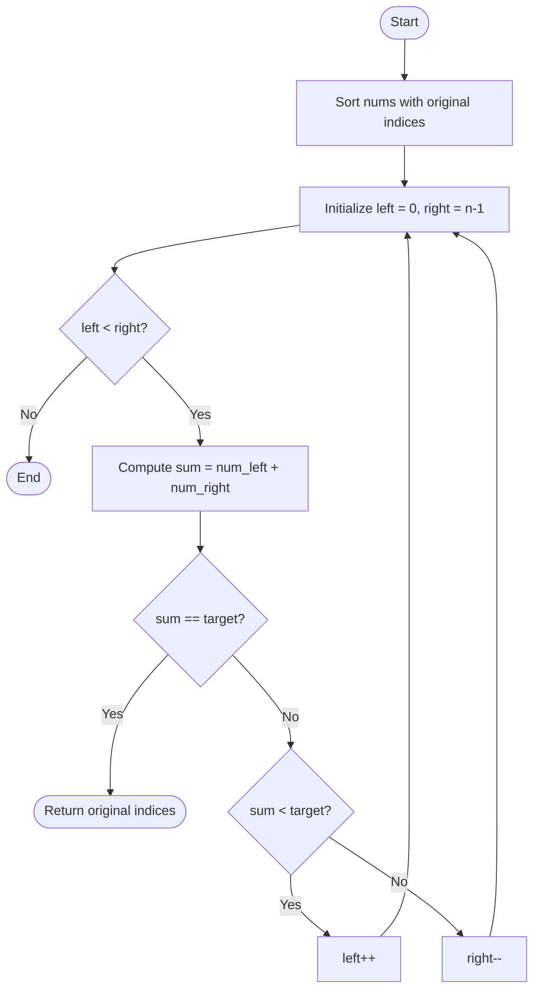

# 🧩 Two Sum Problem  
  
  
  

---

## 📜 Problem Statement  
Given an array of integers `nums` and an integer `target`, return **indices** of the two numbers such that they add up to `target`.  
You may assume that each input would have **exactly one solution**, and you may not use the same element twice.  
Return the answer in **any order**.  

### ✅ Example  
**Input:**  
```
nums = [2,7,11,15], target = 9
```
**Output:**  
```
[0,1]
```
**Explanation:**  
`nums[0] + nums[1] == 9 → 2 + 7 = 9`

---

## 🧠 Explanation & Approaches  

### 🔍 **Understanding the Problem**
We are given:
- An array of integers `nums`
- A target integer `target`

We need to **return indices of two numbers such that their sum equals `target`**.  

**Example Dry Run:**  
```
nums = [2, 7, 11, 15], target = 9
Check pairs:
2 + 7 = 9 ✅ → return [0, 1]
```

---

### ⚠ **Constraints**
- `2 <= nums.length <= 10^4`
- `-10^9 <= nums[i], target <= 10^9`
- Exactly **one solution** exists.

---

### ✅ **Approach 1: Brute Force (O(n²))**
**Idea:**  
Check every possible pair `(i, j)` and see if `nums[i] + nums[j] == target`.  

**Steps:**
1. Loop through each index `i`.
2. For each `i`, loop through `j > i`.
3. If the sum matches the target → return indices `i` and `j`.

**Why it works:**  
It literally checks all possibilities, so it’s guaranteed to find the solution.  

**Drawback:**  
For `n = 10^4`, ~50 million comparisons → **too slow**.  

**📈 Flowchart (Brute Force Approach)**

```mermaid
flowchart TD
    A([Start]) --> B[Loop over each index i in nums]
    B --> C[Loop over each index j > i]
    C --> D{Does nums[i] + nums[j] == target?}
    D -->|Yes| E[Return indices i and j]
    D -->|No| F[Continue inner loop]
    F --> C
    C --> B
    B --> G([End])

---

### ✅ **Approach 2: Hash Map (Optimal) (O(n))**
**Idea:**  
Store seen numbers in a hash map and check if the complement exists.  

**Steps:**
1. Initialize an empty map.
2. For each `num` in `nums`:
   - Calculate `complement = target - num`.
   - If `complement` in map → return `[map[complement], i]`.
   - Else add `num` to map.

**Why it works:**  
Lookup in a hash map is **O(1)** on average, so one pass is enough.

#### 📈 **Flowchart (Hash Map Logic)**  
```mermaid
flowchart TD
    A([Start]) --> B[Initialize empty HashMap]
    B --> C[Loop over each index i in nums]
    C --> D[Compute complement = target - num]
    D --> E{Complement exists in map?}
    E -->|Yes| F[Return indices from map and current index]
    E -->|No| G[Store num -> i in HashMap]
    G --> C
    F --> H([End])
```

---

### ✅ **Approach 3: Two Pointers (O(n log n))**
**Idea:**  
Sort the array and use two pointers:
- Start at both ends, move inward based on sum.

**Steps:**
1. Pair each element with its index.
2. Sort the pairs by value.
3. Initialize two pointers: `left = 0`, `right = n-1`.
4. While `left < right`:
   - If sum == target → return original indices.
   - If sum < target → move `left`.
   - Else move `right`.

**Challenge:** Sorting loses original indices, so we store pairs.

#### 📈 **Flowchart (Two-Pointer Logic)**  


---

### 📊 **Complexity Comparison**
| Approach        | Time Complexity | Space Complexity |
|-----------------|----------------|------------------|
| Brute Force     | O(n²)         | O(1)            |
| Hash Map        | O(n)          | O(n)            |
| Two Pointers    | O(n log n)    | O(n)            |

---

### ✅ **Edge Cases**
- Smallest case: `nums = [1, 2], target = 3`
- Negative numbers: `nums = [-1, -2, -3, -4, -5], target = -8`
- Large numbers: `nums = [10^9, 10^9], target = 2*10^9`

### 🔍 **Understanding the Problem**
We are given:
- An array of integers `nums`
- A target integer `target`

We need to **return indices of two numbers such that their sum equals `target`**.  
Important:
- There is **exactly one valid solution**.
- We **cannot reuse the same element** twice.
- Order of indices **does not matter**.

**Example Dry Run:**  
```
nums = [2, 7, 11, 15], target = 9
Check pairs:
2 + 7 = 9 ✅ → return [0, 1]
```

---

### ⚠ **Constraints**
- `2 <= nums.length <= 10^4`
- `-10^9 <= nums[i], target <= 10^9`
- Exactly **one solution** exists.

**Impact on Approach:**
- Large input size (up to 10^4) → Brute force **O(n²)** might be too slow.
- Negative numbers allowed → No shortcut like early stopping in sorted arrays unless we sort.
- Exactly one solution → No need to handle multiple pairs.

---

### ✅ **Approach 1: Brute Force (O(n²))**
**Idea:** Check every possible pair `(i, j)` and see if `nums[i] + nums[j] == target`.  
**Steps:**
1. Loop through each index `i`.
2. For each `i`, loop through `j > i`.
3. If the sum matches the target → return `[i, j]`.

**Why it works:** It literally checks all possibilities, so it’s guaranteed to find the solution.  
**Drawback:** For `n = 10^4`, we get ~50 million comparisons → **slow**.  

---

### ✅ **Approach 2: Hash Map (Optimal) (O(n))**
**Idea:** Use a hash map to store elements we have seen and their indices. For each element `num`:
- Compute `complement = target - num`.
- If `complement` is in the map → return the indices.
- Otherwise, store `num` in the map.

**Why it works:** Instead of checking all pairs, we check in **constant time** if the complement exists.  
**Steps:**
1. Initialize an empty hash map.
2. Iterate through the array:
   - If `(target - nums[i])` is in the map → return `[map[target - nums[i]], i]`.
   - Else store `nums[i]: i` in the map.

**Trade-off:**  
- Time: **O(n)** (one pass).
- Space: **O(n)** (for the map).

---

### ✅ **Approach 3: Two Pointers (O(n log n))**
**Idea:** Sort the array, then use two pointers:
- Left starts at beginning, right at end.
- If `nums[left] + nums[right] == target` → found.
- If sum < target → move left.
- If sum > target → move right.

**Challenge:** Sorting loses original indices → we need to store `(value, index)` pairs before sorting.  
**When to use:**  
- If the array needs to be sorted anyway for multiple queries.
- Or when index requirement is secondary.

---

### 📊 **Complexity Comparison**
| Approach        | Time Complexity | Space Complexity |
|-----------------|----------------|------------------|
| Brute Force     | O(n²)         | O(1)            |
| Hash Map        | O(n)          | O(n)            |
| Two Pointers    | O(n log n)    | O(n)            |

---

### ✅ **Edge Cases**
- Smallest case: `nums = [1, 2], target = 3`
- Negative numbers: `nums = [-1, -2, -3, -4, -5], target = -8`
- Large numbers: `nums = [10^9, 10^9], target = 2*10^9`

---

## 🛠 Implementations  

---

### ✅ **Python**  

#### **Brute Force**
```python
def two_sum(nums, target):
    # Check every pair
    for i in range(len(nums)):
        for j in range(i + 1, len(nums)):
            if nums[i] + nums[j] == target:
                return [i, j]
```

#### **Hash Map**
```python
def two_sum(nums, target):
    seen = {}
    for i, num in enumerate(nums):
        if target - num in seen:
            return [seen[target - num], i]
        seen[num] = i
```

---

### ✅ **Java**  

#### **Brute Force**
```java
class Solution {
    public int[] twoSum(int[] nums, int target) {
        for (int i = 0; i < nums.length; i++) {
            for (int j = i + 1; j < nums.length; j++) {
                if (nums[i] + nums[j] == target) {
                    return new int[]{i, j};
                }
            }
        }
        return new int[]{};
    }
}
```

#### **Hash Map**
```java
import java.util.*;
class Solution {
    public int[] twoSum(int[] nums, int target) {
        Map<Integer, Integer> map = new HashMap<>();
        for (int i = 0; i < nums.length; i++) {
            int complement = target - nums[i];
            if (map.containsKey(complement)) {
                return new int[]{map.get(complement), i};
            }
            map.put(nums[i], i);
        }
        return new int[]{};
    }
}
```

---

### ✅ **C++**  

#### **Brute Force**
```cpp
class Solution {
public:
    vector<int> twoSum(vector<int>& nums, int target) {
        for (int i = 0; i < nums.size(); i++) {
            for (int j = i + 1; j < nums.size(); j++) {
                if (nums[i] + nums[j] == target) {
                    return {i, j};
                }
            }
        }
        return {};
    }
};
```

#### **Hash Map**
```cpp
#include <unordered_map>
class Solution {
public:
    vector<int> twoSum(vector<int>& nums, int target) {
        unordered_map<int, int> map;
        for (int i = 0; i < nums.size(); i++) {
            int complement = target - nums[i];
            if (map.find(complement) != map.end()) {
                return {map[complement], i};
            }
            map[nums[i]] = i;
        }
        return {};
    }
};
```

---

### ✅ **JavaScript**  

#### **Brute Force**
```javascript
var twoSum = function(nums, target) {
    for (let i = 0; i < nums.length; i++) {
        for (let j = i + 1; j < nums.length; j++) {
            if (nums[i] + nums[j] === target) {
                return [i, j];
            }
        }
    }
};
```

#### **Hash Map**
```javascript
var twoSum = function(nums, target) {
    const map = new Map();
    for (let i = 0; i < nums.length; i++) {
        let complement = target - nums[i];
        if (map.has(complement)) {
            return [map.get(complement), i];
        }
        map.set(nums[i], i);
    }
};
```

---

## 🏷 Tags  
`#LeetCode` `#TwoSum` `#HashMap` `#Array` `#CodingInterview`  

---

### ✅ **Star ⭐ the repo if this helped you!**  
